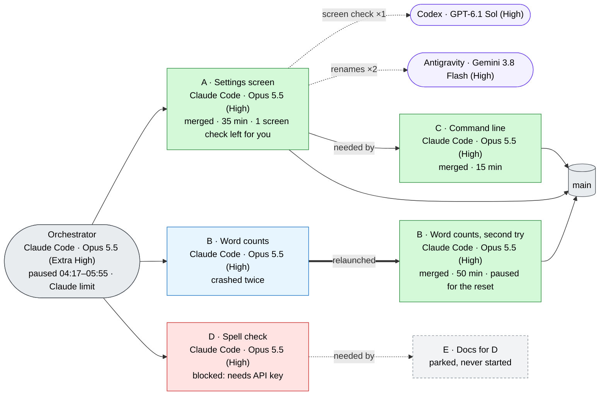

# Final report

The reader is returning after hours away, and probably after several tasks' worth of activity. They want to know whether it worked, what is new, and what they need to decide. Write for that person, not for a reviewer.

## Rules

- Post the report in the chat as your final message, every time the run ends: all tasks merged, some blocked or parked, or stopped early. Post it again, whole and updated, when the outcome changes later, for example after the user's own check lets a blocked task merge. Save a copy in the run directory, but a saved file is not a report the user has received.
- Use plain language. Describe each new thing by what the user can now do, and where to find it. Leave out file names, function names, test counts, commit IDs and review mechanics unless the user needs them to act.
- Gather open decisions from every task's handoff and from your decisions log. Remove duplicates, and phrase each one as a question with one sentence of context.
- Keep recommendations separate from decisions. Never present something a task chose on its own as settled.
- Be honest about anything that didn't finish, was blocked or wasn't verified, such as untested operating systems or a skipped check. One line each is enough.
- Offer the technical detail rather than including it. Each task's full handoff is in its thread and the run directory, and the ledger holds the rest. Never link to `/tmp`.

## Template

```markdown
<One or two sentences: is everything merged into <integration branch>, was anything pushed, and the one thing to do to see it (for example "restart the API server").>

## What was built

**1. <Plain name> (Task A)**
<Two or three sentences in everyday language: what you can now do, and where to find it.>

**2. ...**

## How it ran

<A Mermaid diagram of the run as it actually happened; see "Run diagram" below.>

## Not finished
<Only if some tasks are blocked, parked or failed.>
- **<Task>:** what's missing, why, and what it needs from you.

## Worth checking yourself
<Only if some checks couldn't run, from the tasks' "unchecked" lines, for example real-screen checks while the screen was locked.>
- **<Where to look>:** what to try, and what it should do.

## Open decisions

1. **<Short label>.** <One sentence of context.> <The question?>
2. ...

## Suggested next steps
- <Follow-ups the tasks recommended, or that you noticed. One line each.>

<One closing line: checks passed on <OS>, <other OSes> untested; branches and worktrees cleaned up (or what was kept, and how to restore); ledger at <path>; detailed technical notes available on request.>

<One usage line, for example: "Usage: Claude Max 20x went from 9% to 31% of the week; Codex Plus from 16% to 22%." Add any pause for a reset (which tasks, from when to when), and any other run that used the same subscriptions meanwhile.>
```

## Run diagram

The diagram shows the run that actually happened, not the plan, including who did what. Build it from the ledger: take each agent's harness, model and reasoning level from the host's record that you saved at launch, never from an agent's description of itself, and take durations from the host's timestamps. Take helper hand-offs from the tasks' `helpers` report lines.

- **Orchestrator:** one node, with its harness, model and reasoning level. If it paused for a reset, add the pause as a line, such as `paused 04:17–05:55 · Claude limit`.
- **Tasks:** one node per agent that worked on a task. Each node has three lines:
  - the task ID and a plain name;
  - the harness, model and reasoning level, such as `Claude Code · Opus 5.5 (High)`. Always include the reasoning level, for every provider, because the same model at a different level is a different worker;
  - the outcome and duration.
- **Helper hand-offs:** a rounded node for each helper harness, model and reasoning level a task used, linked by a dotted arrow. The arrow says what was handed over and how many times.
- **Relaunches:** when a new agent took over a task (after a crash, or a move the user approved), draw a node for each attempt, joined by a thick arrow labeled with the reason.
- **Dependencies:** a "needed by" arrow from each prerequisite to the task that waited for it. Arrows from the orchestrator go only to tasks in the first wave.
- **Integration branch:** a final node, with an arrow from every merged task.
- **Small events:** note a nudge, a rebase follow-up, a quota pause or an unchecked real-screen check in the node itself, not on an arrow.
- **Every node gets a class**, the orchestrator included, so none renders unstyled.
- **Short arrow labels**, of a few words. Labels on crossing arrows overlap, so longer explanations go in a node.

Keep the labels in the same plain language as the report.



| Node | Style |
|---|---|
| Orchestrator and integration branch | grey |
| Merged | green |
| Blocked | red |
| Parked | dashed grey |
| Failed | amber |
| Replaced by a relaunch | blue |
| Helper | purple |

Use the same class definitions in every run, so diagrams look alike from one run to the next. If the user's chat view doesn't render Mermaid, the block still reads as a list of nodes and edges, so include it either way.

## Example of the right level

> **4. Approvals (Task C)**
> You can mark tools as "ask first". When the model calls one, the run pauses and shows a card where you Approve or Deny. Experiments never approve on their own; they deny unless the experiment file lists the tools to approve.

Not:

> **Approvals:** added `ApprovalRequested`/`ApprovalDecided` events, a `POST /api/runs/{id}/approvals/{op}` endpoint, 268 tests passing, and a fix for a focus regression found in review round 2.
