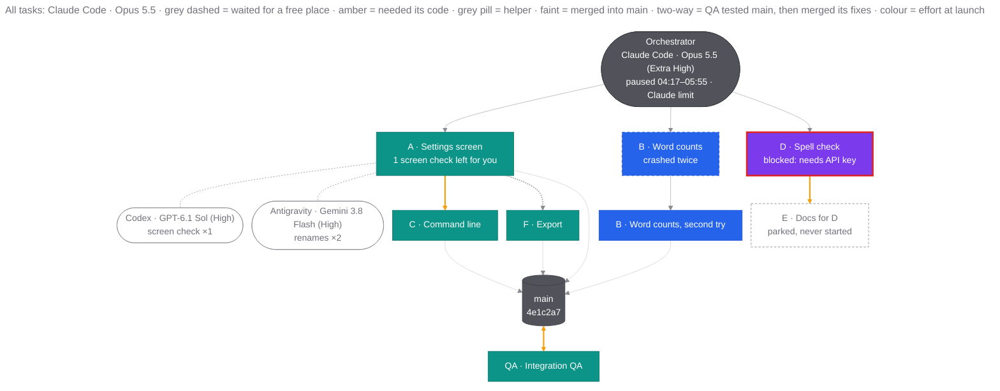

# Final report

The reader is returning after hours away, and probably after several tasks' worth of activity. They want to know whether it worked, what is new, and what they need to decide. Write for that person, not for a reviewer.

## Rules

- Post the report in the chat as your final message, every time the run ends: all tasks merged, some blocked or parked, or stopped early. Post it again, whole and updated, when the outcome changes later, for example after the user's own check lets a blocked task merge. Save a copy in the run directory, but a saved file is not a report the user has received.
- Use plain language. Describe each new thing by what the user can now do, and where to find it. Leave out file names, function names, test counts, commit IDs and review mechanics unless the user needs them to act.
- Gather open decisions from every task's handoff and from your decisions log. Remove duplicates, and phrase each one as a question with one sentence of context.
- Keep recommendations separate from decisions. Never present something a task chose on its own as settled.
- Be honest about anything that didn't finish, was blocked or wasn't verified, such as untested operating systems or a skipped check. One line each is enough.
- Offer the technical detail rather than including it. Each task's full handoff is in its thread and the run directory, and the ledger holds the rest. Never link to `/tmp`.

## Template

```markdown
<One or two sentences: is everything merged into <integration branch>, was anything pushed, and the one thing to do to see it (for example "restart the API server").>

## What was built

**1. <Plain name> (Task A)**
<Two or three sentences in everyday language: what you can now do, and where to find it.>

**2. ...**

## How it ran

<The dependency graph; see "Run charts" below.>

<The timeline; see "Run charts" below.>

<One or two lines the charts can't say on their own, such as why the pauses happened or why effort levels changed.>

## Not finished
<Only if some tasks are blocked, parked or failed.>
- **<Task>:** what's missing, why, and what it needs from you.

## Worth checking yourself
<Only if some checks couldn't run, from the tasks' "unchecked" lines, for example real-screen checks while the screen was locked.>
- **<Where to look>:** what to try, and what it should do.

## Open decisions

1. **<Short label>.** <One sentence of context.> <The question?>
2. ...

## Suggested next steps
- <Follow-ups the tasks recommended, or that you noticed. One line each.>

<One closing line: checks passed on <OS>, <other OSes> untested; branches and worktrees cleaned up (or what was kept, and how to restore); ledger at <path>; detailed technical notes available on request.>

<One usage line, for example: "Usage: Claude Max 20x went from 9% to 31% of the week; Codex Plus from 16% to 22%." Add any pause for a reset (which tasks, from when to when), and any other run that used the same subscriptions meanwhile.>
```

## Run charts

The report has two Mermaid charts of the run as it actually happened, not as planned. The **dependency graph** shows who launched what, what waited for what, and how the work reached the integration branch. The **timeline** shows when each task ran, for how long, and how much of that time it was working. Draw both for every run, in this order.

### Where the facts come from

- **Harness, model and reasoning level:** the host's record you saved at launch, never an agent's description of itself. Note every level change you made during the run.
- **Launch time:** the host's creation time for the task's thread or agent. Convert UTC to the user's local time.
- **Merge time:** the integration branch's reflog, which shows when each task's merge moved it (`git reflog show <branch> --date=format-local:'%H:%M:%S'`). A commit's own date is not its merge time: rebases rewrite it.
- **Worked time:** the sum of the task's turns, each from its start to its completion, from the host's per-turn records (in T3, see [host-t3.md](host-t3.md)). It counts only the task's own agent, not helpers it waited on. Cap it at the total when a task kept talking after its merge. If the host has no per-turn times, show only the total and say so once under the chart.
- **Quota pauses:** from when the first task failed on the limit until you resumed the tasks, from the threads' failed and resumed turns, not from your forecast.
- **Helpers and waits:** the tasks' `helpers` report lines, and your ledger's events.

### Shared style

Both charts must read well on a white and on a black background, because the user's chat view may use either.

- Use `theme: base` and set `fontFamily` at the top level of the init block. Inside `themeVariables` it is ignored and the text falls back to a serif font.
- Use mid-grey `#71717a` for every text that sits on the background: titles, section names, labels beside bars, helper and parked nodes. Put white text only on filled shapes.
- Colour each task by its reasoning level **at launch**, in three bands, and the orchestrator and integration branch in grey:

  | Band | Fill | Border |
  |---|---|---|
  | Above Extra High (Max, Ultracode, Ultrathink) | violet `#7c3aed` | `#6d28d9` |
  | Extra High | blue `#2563eb` | `#1d4ed8` |
  | High or lower | teal `#0d9488` | `#0f766e` |
  | Orchestrator, integration branch | grey `#52525b` | `#3f3f46` |

- Neither chart type has a legend, so explain the colours and line styles in the chart's title.
- **No text on arrows.** Some chat views draw arrow labels dark on dark. Let line styles carry the meaning, and put any detail into a node.
- **Render both charts before posting**, if a Mermaid renderer is available (for example `mmdc` with a Puppeteer config that points at an installed Chrome), once on white and once on black, and look at the images. Check that no label is clipped or unreadable, and that no arrow crosses a label.

### Dependency graph

A top-down `flowchart TB`, built like this:

- **Orchestrator:** one node at the top, with its harness, model and reasoning level. Add any pause as a line, such as `paused 04:17–05:55 · Claude limit`.
- **Tasks:** one node per agent that worked on a task, labelled with the task ID and a plain name. Add a second line only for something the reader must notice, such as `blocked: needs API key`, `crashed twice` or `1 screen check left for you`.
- **Harness and model:** if every task ran on the same harness and model, say it once at the start of the title (`All tasks: Claude Code · Opus 5.5`). Otherwise give each task node a line such as `Codex · GPT-6.1 Sol (High)`, because the same model at a different level is a different worker. The colour shows the level band either way.
- **Launch arrows:** a thin arrow from the orchestrator to every task that started without waiting for another task, whenever it was launched. A task launched hours later because of a quota pause still gets one. Tasks that waited hang below what they waited for instead.
- **Waits:**
  - **Needed its code:** a thick amber arrow (`==>`) from the prerequisite to the task that needed it.
  - **Waited for a free place:** a grey dotted arrow (`-.->`) from the task whose finish made room to the task launched in its place.
- **Helpers:** a rounded node with a grey outline for each helper harness, model and level a task used. It says what was handed over and how many times (`screen check ×1`), and is joined to the task by a dotted line without an arrowhead (`-.-`).
- **Relaunches:** a node for each attempt, the replaced one with a dashed border, joined by a plain arrow. Say why in the replaced node (`crashed twice`).
- **Blocked, failed and parked:** a blocked task keeps its colour, with a thick red border (failed: amber), and no arrow to the integration branch. A parked task that never started has a dashed grey outline and no fill.
- **Integration branch:** a cylinder labelled with the branch and its final commit. Every merged task gets a faint arrow into it. From tasks on the top row, use the longer arrow `--->`, which keeps them on the top row instead of letting them sink to the row of the tasks that waited.
- **Integration QA:** if a last task tested the integration branch and merged its own fixes, join the two with one two-way amber arrow (`<==>`). Don't add a second branch node after QA; on a long run it only makes the graph longer.



`linkStyle` counts arrows in the order they are written, and `A & B --> C` writes one arrow per source. Recount after every change.

### Timeline

A Mermaid `gantt` chart, built like this:

- **Sections:** `Quota pauses` first, then `First wave`, then `Launched later`. Section bands are drawn faintly, so tinted section colours separate them in both themes.
- **Pauses:** one red bar per pause, labelled with its length (`Paused 1h 38m`). If only some tasks paused, say which in the label.
- **Tasks:** one bar per agent that worked on a task, from its launch to its merge, or to when it stopped if it never merged. Tasks that never started get no bar.
- **Labels:** the task ID and plain name; why it started late, if it waited (`needed A`, `took A's place`); the outcome, if it didn't merge (`blocked`, `crashed twice`); the total time and the worked time (`4h 25m, worked 50m`).
- **Reasoning level in the label:** name the level when the colour doesn't pin it down: when it changed during the run (`Ultracode → Extra High`), for any level above Extra High, and for any level below High.
- **Colours come from tags,** because Gantt bars have only four styles: no tag is blue (Extra High), `active` is violet (above Extra High), `done` is teal (High or lower), and `crit` is red (pauses). Here the tags carry no other meaning.

```mermaid
%%{init: {"theme": "base", "themeCSS": ".grid .tick line { stroke-opacity: 0.25; }", "fontFamily": "Helvetica Neue, Helvetica, Arial, sans-serif", "themeVariables": {
  "titleColor": "#71717a", "textColor": "#71717a",
  "sectionBkgColor": "#ef4444", "altSectionBkgColor": "#71717a", "sectionBkgColor2": "#f59e0b",
  "gridColor": "#808080",
  "taskBkgColor": "#2563eb", "taskBorderColor": "#1d4ed8", "taskTextColor": "#ffffff", "taskTextLightColor": "#ffffff", "taskTextDarkColor": "#ffffff", "taskTextOutsideColor": "#71717a",
  "activeTaskBkgColor": "#7c3aed", "activeTaskBorderColor": "#6d28d9",
  "doneTaskBkgColor": "#0d9488", "doneTaskBorderColor": "#0f766e",
  "critBkgColor": "#991b1b", "critBorderColor": "#dc2626"
}, "gantt": {"barHeight": 22, "barGap": 6, "topPadding": 56, "leftPadding": 120, "fontSize": 13, "sectionFontSize": 13, "numberSectionStyles": 3}}}%%
gantt
  todayMarker off
  title Bar = launch to merge or stop · violet above Extra High · blue Extra High · teal High or lower (effort at launch) · red = quota pause
  dateFormat HH:mm
  axisFormat %H:%M
  section Quota pauses
    Paused 1h 38m                                  :crit, p1, 04:17, 05:55
  section First wave
    A · Settings screen · 35m, worked 30m          :done, a, 01:00, 01:35
    B · Word counts · crashed twice · 1h 10m, worked 1h 02m :b1, 01:00, 02:10
    D · Spell check · Max · blocked · 2h 00m, worked 1h 05m :active, d, 01:00, 03:00
  section Launched later
    B · Word counts, second try · 4h 25m, worked 50m :b2, 02:15, 06:40
    C · Command line (needed A) · 15m, worked 14m  :done, c, 01:36, 01:51
    F · Export (took A's place) · 54m, worked 41m  :done, f, 01:36, 02:30
    QA · Integration QA (after all merged) · 45m, worked 44m :done, qa, 06:45, 07:30
```



Copy the init lines of both examples as they are, so the charts look alike from one run to the next. If the user's chat view doesn't render Mermaid, the blocks still read as lists of tasks, times and links, so include them either way.

## Example of the right level

> **4. Approvals (Task C)**
> You can mark tools as "ask first". When the model calls one, the run pauses and shows a card where you Approve or Deny. Experiments never approve on their own; they deny unless the experiment file lists the tools to approve.

Not:

> **Approvals:** added `ApprovalRequested`/`ApprovalDecided` events, a `POST /api/runs/{id}/approvals/{op}` endpoint, 268 tests passing, and a fix for a focus regression found in review round 2.
